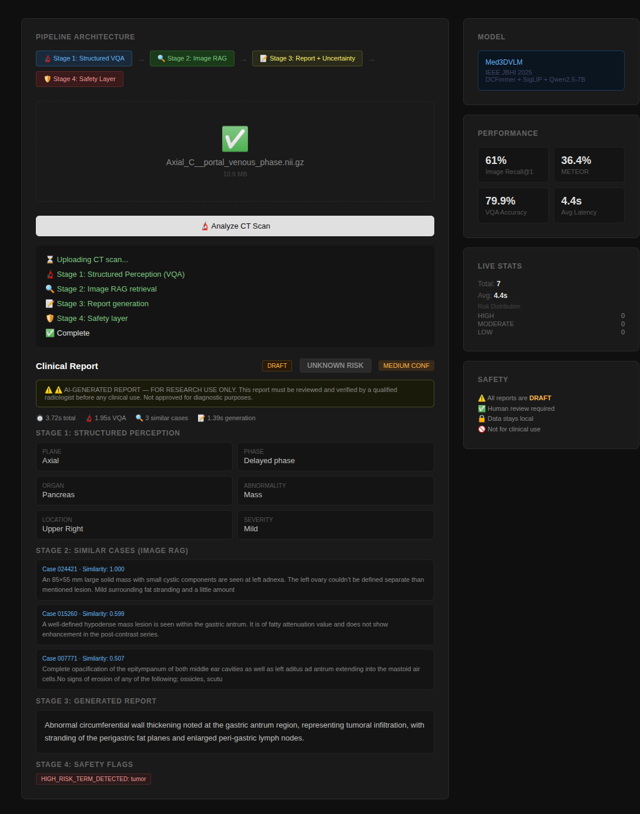

# Medical VLM CT Report Generation System

> **End-to-end CT radiology report generation** based on **Med3DVLM (IEEE JBHI 2025)** — DCFormer 3D encoder + SigLIP contrastive alignment + Qwen2.5-7B LLM + Image RAG via Qdrant. Fully local inference, no GPT-4o dependency.

[](https://ieeexplore.ieee.org/document/11145341/)
[](https://python.org)
[](https://fastapi.tiangolo.com)
[](https://www.nvidia.com)

---

## Live Demo

**Architecture & Results**: http://3.151.59.179:8001



---

## What I Built on Top of Med3DVLM

| Contribution | Description |
|-------------|-------------|
| **Structured Perception** | 6-question VQA before report generation → reduces hallucination |
| **Image RAG System** | DCFormer-SigLIP → Qdrant → Top-3 similar CT retrieval |
| **Uncertainty Estimation** | Multi-sample consistency → HIGH/MEDIUM/LOW confidence |
| **Clinical Safety Layer** | Always DRAFT, review_required: True, risk term detection |
| **End-to-end Deployment** | FastAPI + Web UI + SQLite monitoring |

---

## 4-Stage Pipeline

CT (.nii.gz)
↓
Stage 1: Structured VQA Perception    → 79.95% accuracy
↓
Stage 2: Image RAG (DCFormer-SigLIP)  → Recall@1 = 61.00%
↓
Stage 3: Report + Uncertainty         → METEOR = 36.42%
↓
Stage 4: Safety Layer                 → Always DRAFT
↓
JSON Response

---

## Experimental Results (RTX 3090)

| Metric | Value |
|--------|-------|
| Image-Text Recall@1 | **61.00%** (2000 candidates) |
| Report METEOR | **36.42%** |
| VQA Accuracy | **79.95%** |
| Inference Latency | **~3s** (full pipeline) |
| Cost per Query | **$0** (fully local) |

---

## V1 vs V2

| Dimension | V1: Merlin+GPT-4o | V2: Med3DVLM |
|-----------|-------------------|--------------|
| CT Feature | mean/std/norm (3 scalars) | Full 3D volume (DCFormer) |
| Retrieval | Text RAG | **Image RAG (SigLIP)** |
| Alignment | ❌ None | ✅ SigLIP |
| Generation | GPT-4o ($0.0003/q) | **Qwen2.5-7B ($0)** |
| Latency | ~13s CPU | **~3s RTX 3090** |
| Recall@1 | 0.696 (64 cand.) | **61.00% (2000 cand.)** |

---

## Quick Start

```bash
git clone https://github.com/jianghongcheng/medical-vlm-assistant.git
cd medical-vlm-assistant

# Setup Med3DVLM
git clone https://github.com/mirthAI/Med3DVLM.git ../Med3DVLM
ln -sf ../Med3DVLM/src ./src
ln -sf ../Med3DVLM/models ./models

# Download models
python -c "
from huggingface_hub import snapshot_download
snapshot_download('MagicXin/DCFormer_SigLIP', local_dir='./models/DCFormer_SigLIP')
snapshot_download('MagicXin/Med3DVLM-Qwen-2.5-7B', local_dir='./models/Med3DVLM-Qwen-2.5-7B')
"

# Install & run
conda create -n Med3DVLM python=3.12 && conda activate Med3DVLM
pip install torch==2.6.0 --index-url https://download.pytorch.org/whl/cu124
pip install fastapi uvicorn python-multipart qdrant-client SimpleITK transformers

docker run -d -p 6333:6333 qdrant/qdrant
python scripts/populate_qdrant.py
export PYTHONPATH=$(pwd):$PYTHONPATH
python -m uvicorn api.main:app --host 0.0.0.0 --port 8001
```

---

## Tech Stack

| Layer | Technology |
|-------|-----------|
| 3D VLM | Med3DVLM (IEEE JBHI 2025) |
| Vision Encoder | DCFormer |
| Alignment | SigLIP |
| LLM | Qwen2.5-7B |
| Vector DB | Qdrant |
| API | FastAPI |
| Hardware | RTX 3090 (24GB) |

---

## Citation

```bibtex
@article{xin2025med3dvlm,
  title={Med3DVLM: An Efficient Vision-Language Model for 3D Medical Image Analysis},
  author={Xin, Yu and Ates, Gorkem Can and Gong, Kuang and Shao, Wei},
  journal={IEEE Journal of Biomedical and Health Informatics},
  year={2025},
  doi={10.1109/JBHI.2025.3604595}
}
```

---

## Author

**Hongcheng (Gabe) Jiang** — PhD ECE, UMKC (GPA: 4.0)

[](https://github.com/jianghongcheng)
[](https://www.linkedin.com/in/hongcheng-jiang-a31860181)
